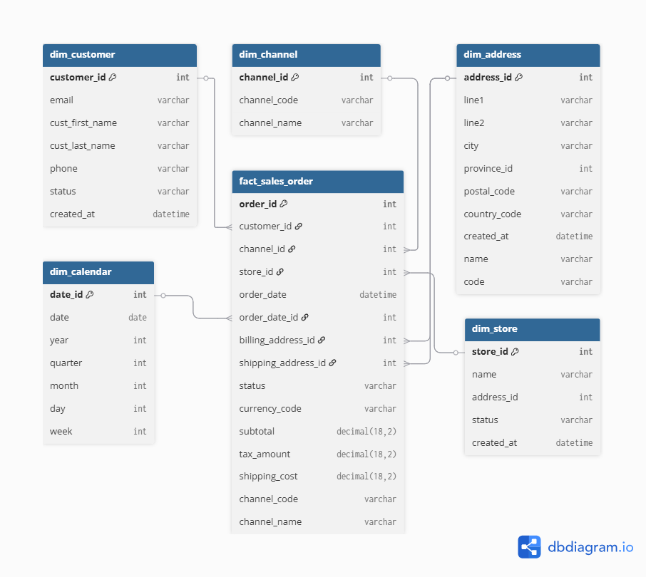
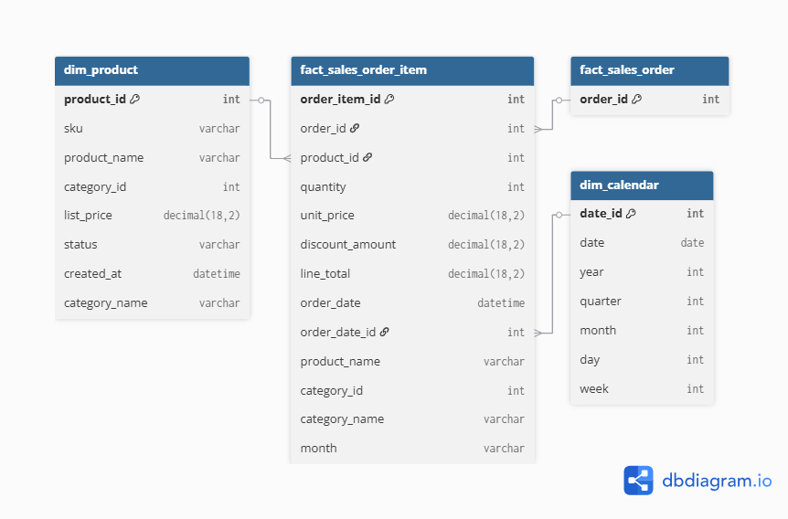
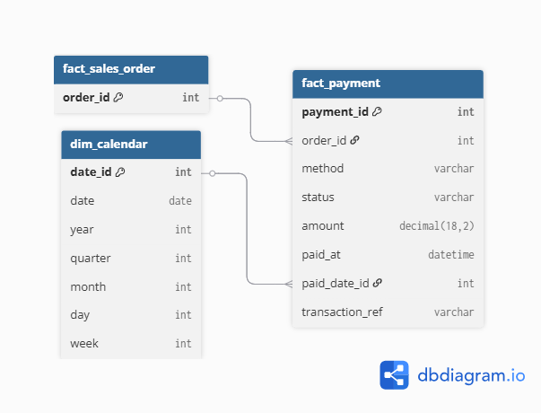
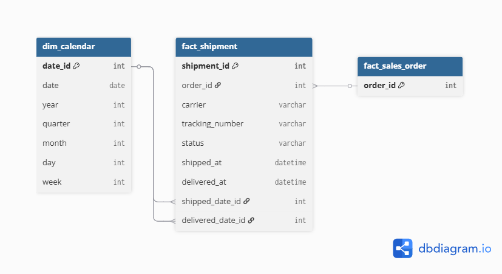
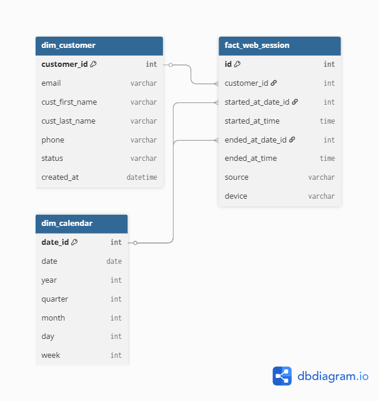
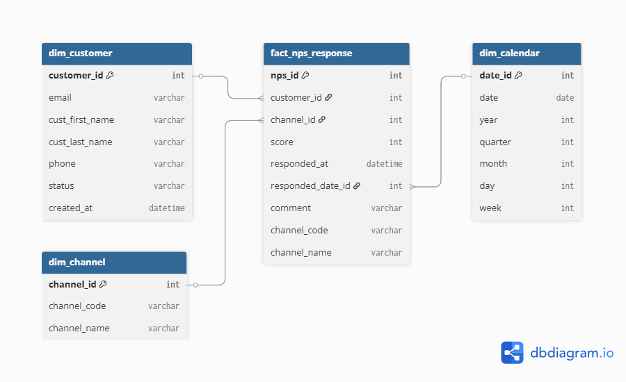

# Trabajo Práctico Final – Marketing Analytics

## 1) Objetivo
Construir un mini **data warehouse** a partir de CSVs crudos (`/raw`), generar tablas desnormalizadas en `/DW`, y documentar el proceso con buenas prácticas (entorno virtual, requirements, commits convencionales).

## 2) Estructura del repositorio  

El proyecto está organizado de forma modular siguiendo las buenas prácticas del desarrollo de un **Data Warehouse** bajo la metodología **Kimball**.  
Cada carpeta representa una etapa del flujo de datos: desde la obtención de las fuentes crudas hasta la generación de los resultados finales y la documentación del proceso.

- **raw/**: contiene los datos fuente originales en formato CSV, sin procesar.  
- **DW/**: almacena las tablas desnormalizadas generadas por el proceso ETL, listas para su análisis.  
- **assets/**: reúne el material visual del proyecto, incluyendo el diagrama entidad-relación (DER), los modelos estrella y las capturas del dashboard.  
- **venv/**: corresponde al entorno virtual local que aísla las dependencias del proyecto y evita conflictos de versiones (no se versiona en Git).  
- **build_dw.py**: script principal que ejecuta el proceso ETL (extracción, transformación y carga de datos).  
- **requirements.txt**: archivo que lista todas las librerías necesarias para reproducir el entorno de trabajo.  
- **README.md**: documento principal del proyecto, que detalla los objetivos, pasos de instalación, supuestos, estructura y diseño del modelo de datos.  

Esta estructura facilita la trazabilidad, la colaboración y la reproducibilidad del proyecto.


## 3) Requisitos

Para ejecutar correctamente el proyecto se requiere el siguiente entorno:

- **Python 3.10 o superior** → lenguaje principal utilizado para el proceso ETL.  
- **Visual Studio Code (VS Code)** o cualquier editor con soporte para terminal integrada.  
- **Git** → para clonar el repositorio y gestionar versiones.  
- **Sistema operativo compatible**: Windows, macOS o Linux.  
- (Opcional) **Google Looker Studio** u otra herramienta de BI para visualizar los resultados finales.

## 4) Instalación y ejecución

### 4.1 Clonar y entrar
```bash
git clone https://github.com/justoborras2006/mkt_tp_final.git
cd mkt_tp_final
```
### 4.2 Crear y activar entorno virtual

**Windows (PowerShell):**
```bash
python -m venv venv
venv\Scripts\activate
```

Si PowerShell bloquea scripts:
```bash
Set-ExecutionPolicy RemoteSigned
```

**macOS / Linux:**
```bash
python3 -m venv venv
source venv/bin/activate
```

---

### 4.3 Instalar dependencias
```bash
pip install -r requirements.txt
```

Si falta el archivo:
```bash
pip install pandas python-dateutil
pip freeze > requirements.txt
```

### 4.4 Ejecutar el ETL

Para generar las tablas desnormalizadas, ejecutá el siguiente comando en la terminal (dentro del entorno virtual):

```bash
python build_dw.py
```

Si todo funciona correctamente, vas a ver mensajes en la consola indicando que los archivos fueron procesados y exportados.

El resultado final se guarda dentro de la carpeta `/DW`, donde deberías encontrar las tablas fact y dimension generadas por el proceso ETL.  
Cada CSV representa una tabla lista para análisis, como por ejemplo: `fact_sales_order.csv`, `dim_customer.csv` o `fact_payment.csv`.  
Podés abrirlas con Excel, Python o cargarlas en una herramienta de BI como Looker Studio para comenzar el análisis de datos.

## 5) Supuestos

- Todas las claves técnicas utilizan el sufijo `_id` para mantener coherencia en las relaciones entre tablas.  
- La clave `date_id` se construye con el formato `YYYYMMDD`, garantizando unicidad por día.  
- La tabla `dim_calendar` se genera a partir de las fechas presentes en las fuentes originales, sin valores faltantes.  
- La columna `month` en `fact_sales_order_item` se deriva directamente de la fecha `order_date`.  
- Todos los montos monetarios se expresan en la moneda indicada en la columna `currency_code` de `fact_sales_order`.  
- Las relaciones entre dimensiones y hechos se realizan mediante claves sustitutas, no naturales, para asegurar consistencia en la desnormalización.

## 6) Diccionario de datos y granos

### dim_channel  
Contiene los distintos canales de venta y comunicación a través de los cuales los clientes realizan pedidos o interacciones.  
**Columnas:** `channel_id`, `channel_code`, `channel_name`  
*Grano: una fila por canal disponible.*

---

### dim_customer  
Incluye información identificatoria y de contacto de cada cliente registrado.  
**Columnas:** `customer_id`, `email`, `cust_first_name`, `cust_last_name`, `phone`, `status`, `created_at`  
*Grano: una fila por cliente.*

---

### dim_address  
Agrupa las direcciones de facturación y envío vinculadas a clientes o pedidos.  
**Columnas:** `address_id`, `line1`, `line2`, `city`, `province_id`, `postal_code`, `country_code`, `created_at`, `name` (provincia), `code` (abreviatura)  
*Grano: una fila por dirección registrada.*

---

### dim_product  
Contiene el catálogo de productos y su información descriptiva, junto con la categoría a la que pertenecen.  
**Columnas:** `product_id`, `sku`, `product_name`, `category_id`, `list_price`, `status`, `created_at`, `category_name`  
*Grano: una fila por producto.*

---

### dim_store  
Lista las tiendas físicas donde se realizan ventas o retiradas de pedidos.  
**Columnas:** `store_id`, `name`, `address_id`, `status`, `created_at` (dependiendo del CSV disponible)  
*Grano: una fila por tienda.*

---

### dim_calendar  
Generada a partir de todas las fechas presentes en las fuentes, permite análisis temporales.  
**Columnas:** `date_id`, `date`, `year`, `quarter`, `month`, `day`, `week`  
*Grano: una fila por fecha única presente en los datos.*

---

### fact_sales_order  
Representa cada pedido completo realizado por un cliente. Incluye totales, impuestos, costos de envío y vínculos con cliente, canal, tienda y direcciones.  
**Columnas:** `order_id`, `customer_id`, `channel_id`, `store_id`, `order_date`, `order_date_id`, `billing_address_id`, `shipping_address_id`, `status`, `currency_code`, `subtotal`, `tax_amount`, `shipping_cost`, `channel_code`, `channel_name`  
*Grano: una fila por pedido confirmado (nivel cabecera).*

---

### fact_sales_order_item  
Contiene el detalle de los ítems vendidos dentro de cada pedido. Permite medir unidades, descuentos y totales por producto o categoría.  
**Columnas:** `order_item_id`, `order_id`, `product_id`, `quantity`, `unit_price`, `discount_amount`, `line_total`, `order_date`, `product_name`, `category_id`, `category_name`, `month`  
*Grano: una fila por producto vendido en una orden.*

---

### fact_payment  
Registra cada transacción de pago asociada a un pedido. Puede haber múltiples pagos por orden.  
**Columnas:** `payment_id`, `order_id`, `method`, `status`, `amount`, `paid_at`, `transaction_ref`  
*Grano: una fila por pago realizado.*

---

### fact_shipment  
Refleja cada envío generado para cumplir un pedido, incluyendo carrier, tracking y fechas clave.  
**Columnas:** `shipment_id`, `order_id`, `carrier`, `tracking_number`, `status`, `shipped_at`, `delivered_at`  
*Grano: una fila por envío despachado.*

---

### fact_web_session  
Registra cada sesión iniciada por un usuario en el canal digital, con sus fechas, origen y dispositivo.  
**Columnas:** `id`, `customer_id`, `started_at_date_id`, `started_at_time`, `ended_at_date_id`, `ended_at_time`, `source`, `device`  
*Grano: una fila por sesión web iniciada.*

---

### fact_nps_response  
Registra las respuestas de los clientes a las encuestas de satisfacción (NPS), indicando canal, puntuación y comentario.  
**Columnas:** `nps_id`, `customer_id`, `channel_id`, `score`, `responded_at`, `comment`, `channel_code`, `channel_name`  
*Grano: una fila por respuesta de encuesta enviada por un cliente.*

## 7) Metodología y diseño del modelo

El **modelo de datos** se diseñó siguiendo la **metodología Kimball**, orientada a la creación de *Data Warehouses* mediante esquemas en estrella.  
Este enfoque se basa en la identificación de **tablas de hechos** que centralizan los eventos del negocio (ventas, pagos, envíos, etc.) y **tablas de dimensiones** que describen los contextos relacionados (cliente, producto, calendario, canal, tienda, dirección).  

Cada modelo se desarrolló a partir de los archivos crudos (`/raw`) y se desnormalizó con un proceso ETL automatizado en `build_dw.py`, generando las salidas finales en `/DW`.  
El resultado es una estructura optimizada para el análisis en herramientas como **Looker Studio**, garantizando consistencia, trazabilidad y eficiencia en las consultas.

---

## 8) Esquemas estrella (Star Schemas)

A continuación, se presentan los **seis modelos estrella** construidos para el *data warehouse*:

### 1. Ventas  
**Hecho principal:** `fact_sales_order`  


---

### 2. Ítems de venta  
**Hecho principal:** `fact_sales_order_item`  


---

### 3. Pagos  
**Hecho principal:** `fact_payment`  


---

### 4. Envíos  
**Hecho principal:** `fact_shipment`  


---

### 5. Sesiones web  
**Hecho principal:** `fact_web_session`  


---

### 6. NPS (Satisfacción del cliente)  
**Hecho principal:** `fact_nps_response`  


---

## 9) Buenas prácticas

El repositorio fue diseñado siguiendo buenas prácticas que permiten a terceros reproducir el entorno, comprender el flujo de trabajo y mantener la integridad del proyecto.

- **Reproducibilidad**: cualquier usuario puede clonar el repositorio, instalar las dependencias desde `requirements.txt` y ejecutar el ETL en su propio entorno local.  
- **Entorno controlado**: el uso de `venv` garantiza un entorno de ejecución aislado, evitando conflictos entre versiones de librerías.  
- **Documentación clara**: el archivo `README.md` detalla la estructura, los pasos de instalación, los supuestos y el diseño del modelo de datos, facilitando la comprensión del proyecto.  
- **Estandarización de commits**: se aplicó el formato *Conventional Commits* (`feat:`, `fix:`, `docs:`, `refactor:`) para mantener un historial limpio y fácil de seguir.  
- **Trazabilidad completa**: los diagramas, el diccionario de datos y el script `build_dw.py` reflejan de forma coherente el mismo modelo conceptual y lógico.  
- **Separación de entornos**: la carpeta `venv/` se excluye del control de versiones mediante `.gitignore`, manteniendo el repositorio liviano y portable.  
- **Integridad del flujo de datos**: se respetaron relaciones de claves primarias y foráneas en cada modelo estrella, garantizando consistencia en los análisis posteriores.  
- **Transparencia y mantenimiento**: la estructura modular y la nomenclatura uniforme facilitan que cualquier integrante del equipo pueda continuar el desarrollo o hacer mejoras.

Estas prácticas aseguran que el proyecto sea **entendible, reproducible y mantenible** por terceros, cumpliendo con los estándares de trabajo colaborativo y profesional en ingeniería de datos.

## 10) Créditos y licencia

Proyecto desarrollado en el marco de la materia **Introducción al Marketing Online y los Negocios Digitales (2025)**, dentro de la **Licenciatura en Ciencia de Datos** de la **Universidad Austral**.  
Los datos utilizados son simulados y se emplean únicamente con fines educativos y de práctica profesional.

**Autor:** Justo Borrás  
**Repositorio:** mkt_tp_final  
**Licencia:** MIT License  
**Año:** 2025
